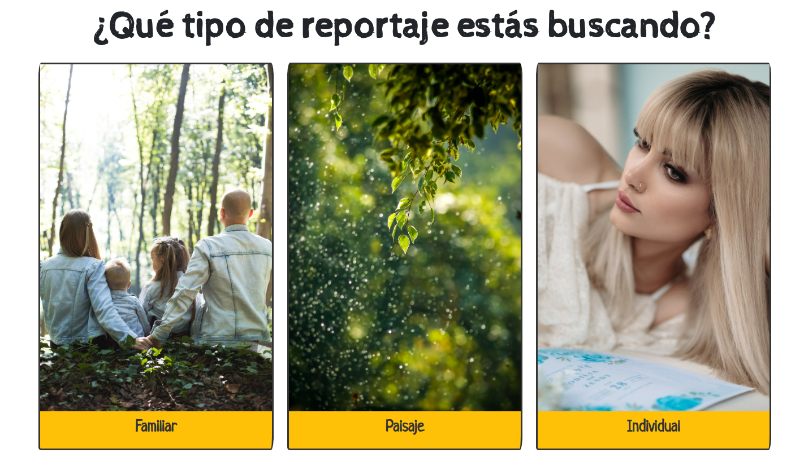
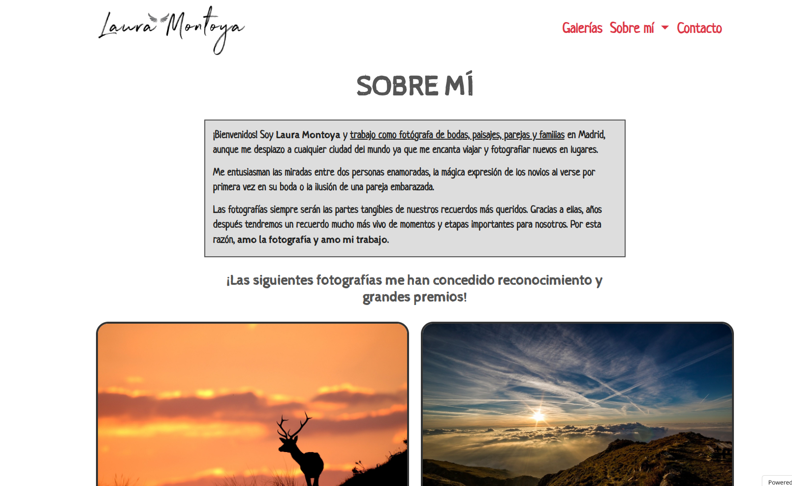
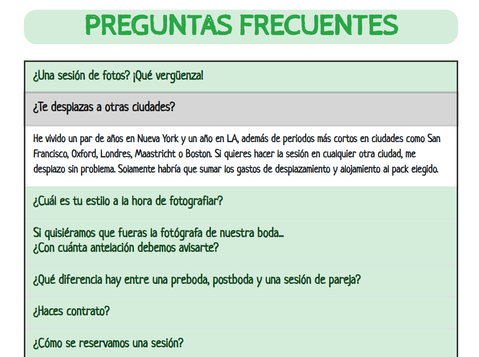
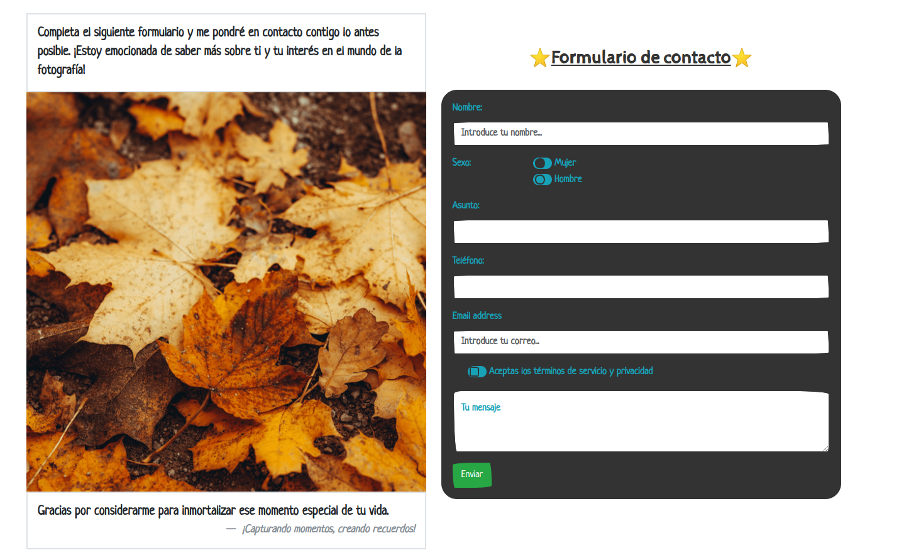
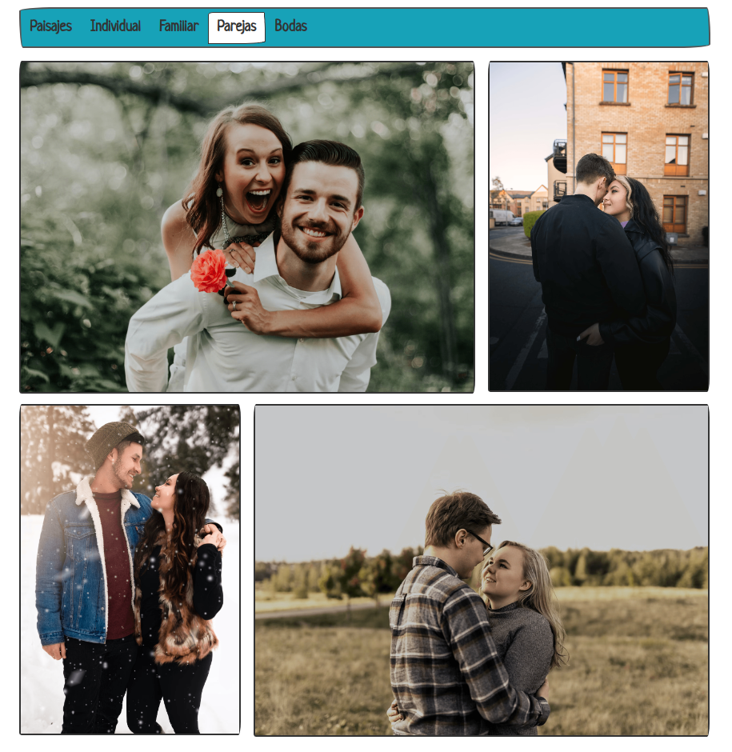
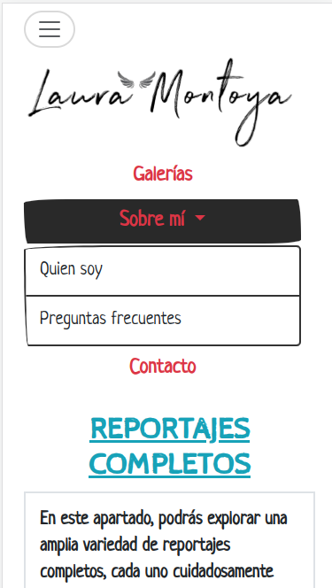

# Presentación y descripción del proyecto

Prototipo web de tipo presentación realizado con __Bootstrap 5__. La temática es una página web personal centrada en la fotografía de paisajes, bodas y parejas.

Página web del proyecto: [Laura Montoya](https://montoya-laura.000webhostapp.com/index.html)

# Componentes

He integrado diferentes componentes en la página web tales como:
* Acordeon
* Carrousel
* Lista agrupada
* Formulario
* Menú desplegable
* Pestañas agrudapdas con distintos componentes anteriores como carrousel, cards, etc...

# Fotos de la página web

# Recursos
Página tomada como inspiración:
* [Leyre Canizares](https://leyrefotografia.com)

Plantilla de Bootstrap utilizada (en la primera versión):
* [Estilos](https://bootswatch.com/sketchy/)
